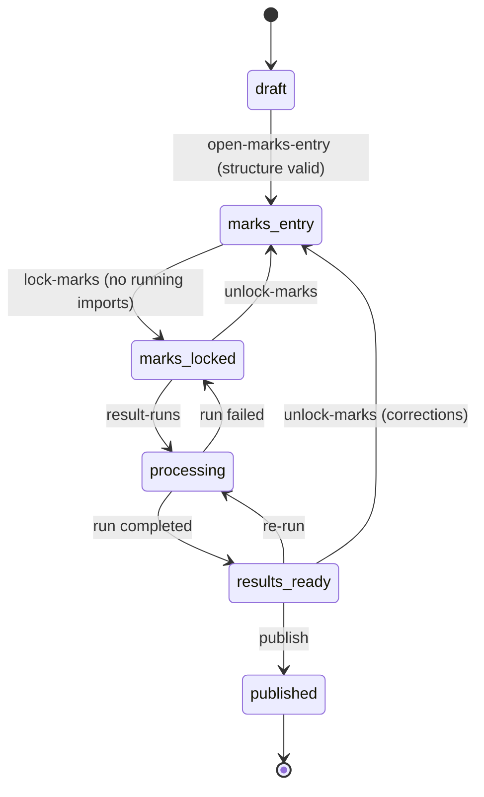

# University Examination & Result Processing System

A backend for running university examinations end to end. Staff define the course
structure, enter marks (one at a time or by bulk CSV of 100k+ rows), lock the marks,
compute results asynchronously and publish them to students.

**Stack:** PHP 8.3 · Laravel 12 · MySQL 8.4 (MariaDB 10.4+ also supported) · Redis 7 (queues + cache) · nginx + php-fpm · Docker Compose

---

## Contents

1. [Quick start](#1-quick-start)
2. [Walkthrough (curl)](#2-walkthrough)
3. [Architecture](#3-architecture)
4. [Business rules](#4-business-rules)
5. [Database design and ER diagram](#5-database-design)
6. [Queue design](#6-queue-design)
7. [Transaction strategy](#7-transaction-strategy)
8. [Idempotency strategy](#8-idempotency-strategy)
9. [Concurrency strategy](#9-concurrency-strategy)
10. [Failure and retry strategy](#10-failure-and-retry-strategy)
11. [Scaling considerations](#11-scaling-considerations)
12. [Technology choices](#12-technology-choices)
13. [Trade-offs](#13-trade-offs)
14. [Assumptions and intentionally incomplete areas](#14-assumptions-and-intentionally-incomplete-areas)
15. [Testing](#15-testing)
16. [Code tour (start here if you are new)](#16-code-tour-start-here-if-you-are-new)

---

## 1. Quick start

```bash
docker compose up --build
```

That one command builds the image, starts MySQL and Redis, runs migrations (a one-shot
`migrate` service), and then starts the API, 3 queue workers, the scheduler and Swagger UI.

| What | Where |
|---|---|
| **Web pages (UI)** | http://localhost:8080 |
| **Student result lookup** | http://localhost:8080/results |
| API | http://localhost:8080/api/v1 |
| Swagger UI (try every endpoint) | http://localhost:8080/docs (also http://localhost:8081) |
| OpenAPI spec | http://localhost:8080/openapi.yaml |
| Health | http://localhost:8080/up |

Authentication is off by default so evaluation is frictionless. To turn it on:
`API_KEYS="registrar:secret1,examcell:secret2" docker compose up`, then send
`Authorization: Bearer secret1`.

### Load a large data set (100k+ marks)

```bash
# 20,000 students x 2 courses x 3 components = 120,000 marks expected
docker compose exec app php artisan exams:demo-seed --students=20000 --courses=2
# writes storage/app/demo-marks-1.csv (≈0.5% deliberately invalid rows)
docker compose exec -u www-data app php artisan exams:generate-csv 1
docker compose cp app:/var/www/html/storage/app/demo-marks-1.csv ./demo.csv

curl -F "file=@demo.csv" -H "Accept: application/json" \
     http://localhost:8080/api/v1/examinations/1/mark-imports
# poll the returned links.self for live progress
```

Measured on a laptop (Docker Desktop on Windows, 3 workers):

| Operation | Volume | Wall time |
|---|---|---|
| CSV upload request (HTTP) | 120,000 rows / 3.9 MB | < 1 s (returns 202) |
| Import end to end | 120 chunks, 119,380 applied, 620 rejected with reasons | ≈ 33 s |
| Result processing | 20,000 students / 40,000 course results | ≈ 19 s |

Both pipelines scale roughly linearly with worker count: `docker compose up --scale worker=8`.

### Local development without Docker

```bash
# Uses a local MySQL/MariaDB (e.g. XAMPP): DB_DATABASE=examination, root, no password
cp .env.example .env && composer install && php artisan key:generate
php artisan migrate
php artisan serve        # web pages + API at http://127.0.0.1:8000
php artisan queue:work   # REQUIRED in a second terminal: processes uploads and results
```

---

## 2. Walkthrough

### Using the web pages

Simple server-rendered Blade pages (`resources/views/`, controllers in `app/Http/Controllers/Web/`).
They use ordinary HTML forms and call the same services as the API, so the business rules are shared.

| Page | What you do there |
|---|---|
| **Programmes, courses & students** (`/setup`) | Create programmes and courses. Add students, one per line: `registration_no, name, programme_code` |
| **Examinations** (`/`) | Create an examination and open it |
| **Examination page** (`/examinations/{id}`) | Top: status and the next allowed step (open marks entry, lock, unlock, process results, publish).<br>Courses: add a course with its components (`code, name, max marks, weight %, min to pass`, one per line).<br>Enroll students into a course.<br>Marks: add a mark, edit a mark, upload a CSV, and see rejected CSV rows.<br>Results: summary and the list of students; click a student for their course breakdown |
| **API docs** (`/docs`) | Swagger UI: every API endpoint, with "Try it out" to send real requests |
| **Student result lookup** (`/results`) | A student enters the examination code and registration number. Only published results are shown |

While an upload or a result run is working, the examination page refreshes itself every 3 seconds.
Editing a mark uses the version number: if someone else saved the mark first, you get a message and
the latest value instead of overwriting their change.

### Using curl

```bash
API=http://localhost:8080/api/v1
H='-H Content-Type:application/json -H Accept:application/json'

# Master data (idempotent upserts by natural key)
curl $H -X POST $API/programmes -d '{"code":"BTECH","name":"B.Tech"}'
curl $H -X POST $API/courses    -d '{"programme_code":"BTECH","code":"CS101","title":"Programming","credits":4}'
curl $H -X POST $API/students   -d '{"students":[{"registration_no":"S001","name":"Asha","programme_code":"BTECH"}]}'

# Examination in DRAFT, add a course with weighted components (weights must sum to 100)
curl $H -X POST $API/examinations -d '{"code":"SEM1-2026","name":"Semester 1","academic_year":"2026-27"}'
curl $H -X PUT  $API/examinations/1/courses/CS101 -d '{"pass_percentage":40,"components":[
  {"code":"MID","name":"Mid term","max_marks":30,"weight":30},
  {"code":"END","name":"End term","max_marks":70,"weight":70,"min_pass_marks":28}]}'
curl $H -X POST $API/examinations/1/enrollments -d '{"course_code":"CS101","registration_nos":["S001"]}'

# DRAFT -> MARKS_ENTRY
curl $H -X POST $API/examinations/1/open-marks-entry

# Marks: one at a time (optimistic concurrency) ...
curl $H -X PUT $API/examinations/1/marks -H 'Idempotency-Key: ui-7f3a-0001' \
     -d '{"registration_no":"S001","course_code":"CS101","component_code":"MID","marks":24.5}'
curl $H -X PUT $API/examinations/1/marks \
     -d '{"registration_no":"S001","course_code":"CS101","component_code":"MID","marks":25,"expected_version":1}'
# ... or in bulk
curl -H Accept:application/json -F file=@marks.csv $API/examinations/1/mark-imports
curl $API/examinations/1/progress           # expected vs entered marks per course

# Lock, process, publish
curl $H -X POST $API/examinations/1/lock-marks
curl $H -X POST $API/examinations/1/result-runs      # 202 + run id, poll /result-runs/{id}
curl $API/examinations/1/results/S001                # staff view
curl $H -X POST $API/examinations/1/publish
curl $API/public/examinations/SEM1-2026/results/S001 # student view (published only)
```

CSV format (header required, any column order, extra columns ignored, UTF-8 BOM tolerated):

```csv
registration_no,course_code,component_code,marks
S001,CS101,MID,24.5
S001,CS101,END,AB
```

`marks` is a non-negative number with at most 2 decimals, or `AB`/`ABSENT` for absent.

---

## 3. Architecture

```
                 ┌──────────── HTTP (nginx → php-fpm, stateless, horizontally scalable) ─────────────┐
 client ───────▶ │ auth (API key) → Idempotency-Key middleware → controller → domain service          │
                 └───────┬───────────────────────────────┬──────────────────────────────┬───────────┘
                         │ small sync writes             │ store file + enqueue         │ enqueue
                         ▼                               ▼                              ▼
                 ┌──────────────┐             ┌──────────────────────┐       ┌───────────────────────┐
                 │    MySQL     │◀────────────│ Redis queue "imports"│       │ Redis queue "results" │
                 │  (source of  │   workers   │ Split → N×Chunk →    │       │ Plan → N×Compute →    │
                 │    truth)    │◀────────────│ Finalize             │       │ Finalize              │
                 └──────────────┘             └──────────────────────┘       └───────────────────────┘
                         ▲                    shared file storage (volume / S3)
                         └── Redis cache: examination structure snapshot (immutable after DRAFT)
```

**Layers**

| Layer | Responsibility | Where |
|---|---|---|
| HTTP | validation, auth, idempotency, JSON envelopes | `app/Http` |
| Services | business rules, transactions, locking; grading rules in `ResultCalculator` (no database access) | `app/Services` |
| Jobs | async pipelines, all idempotent | `app/Jobs` |

Design principles:

- **The HTTP path never does bulk work.** An upload stores the file, writes one row and
  enqueues a job, so request latency does not depend on file size.
- **A single state machine guards everything.** Every write asks the examination's status
  (under a lock) whether it is allowed.
- **Every async step is idempotent.** The queue delivers at least once, so every job can
  safely run twice.
- **Grading rules are plain functions with no database access** (`ResultCalculator`), so they are unit-tested
  exhaustively and don't depend on the processing strategy.

### Examination lifecycle



| State | Structure edits | Enrollment | Marks writes | Results visible |
|---|---|---|---|---|
| draft | ✅ | ✅ | ❌ | ❌ |
| marks_entry | ❌ | ✅ | ✅ | ❌ |
| marks_locked / processing | ❌ | ❌ | ❌ | ❌ |
| results_ready | ❌ | ❌ | ❌ | staff only |
| published | ❌ | ❌ | ❌ | staff + students |

Requesting the state an examination is already in is a no-op, so transitions are
idempotent.

---

## 4. Business rules

- A **programme** has students and a course catalogue.
- An **examination** (e.g. "Semester 1, Nov 2026") offers many **courses**. Each offering
  (`examination_courses`) carries its own pass percentage and **assessment components**
  (e.g. MID 30 marks/30%, END 70 marks/70%, optional per-component minimum).
- Students **enroll** per course offering, and receive one **mark** per component (or are
  marked absent).

**Result rules** (`app/Services/ResultCalculator.php`):

| Situation | Course outcome |
|---|---|
| any component has no mark row | `withheld`: no grade, result cannot be declared |
| absent in every component | `absent`, grade `AB` |
| weighted % = Σ(marks / max × weight), absent counts as 0, rounded half-up to 2 dp | |
| % below the pass percentage, **or** any component minimum not met | `fail`, grade `F`, 0 grade points |
| otherwise | `pass`, grade from the configurable scale (`config/exams.php`: O/A+/A/B+/B/C/P) |

For the examination as a whole: `SGPA = Σ(credits × grade point) / Σ credits`. The status
is `pass` only if every course passed, and `withheld` if any course is withheld (no SGPA).

Marks are parsed as **integer hundredths** (`"45.5"` → `4550`). Validation and range checks
therefore never go through binary floating point, and the database stores `DECIMAL(6,2)`.

---

## 5. Database design

### ER diagram


Infrastructure tables (not shown): `idempotency_keys`, `jobs`, `job_batches`, `failed_jobs`, `cache`.

### Key decisions

| Decision | Why |
|---|---|
| **Natural-key unique indexes** (`students.registration_no`, `courses.code`, `(examination_course_id, student_id)`, `(enrollment_id, assessment_component_id)`, `(examination_id, student_id)` on results) | Every write path is an `INSERT … ON DUPLICATE KEY UPDATE` / `INSERT IGNORE`. Uniqueness is enforced by the database, not by application checks that can race. |
| **`examination_courses` is separate from `courses`** | The same course can be examined in many sessions with different components and weights. The catalogue stays clean. |
| **`examination_id` denormalised onto `enrollments`, `marks` and results** | All hot queries are scoped by examination without joins, and it is the natural partition key (§11). |
| **`marks.version`** | Optimistic-concurrency token for interactive edits (§9). |
| **Results are materialised** (`course_results`, `examination_results`), tagged with `result_run_id` | Reads are O(1) per student. A re-run overwrites deterministically, and stale rows are removed by run id. |
| **Publishing is a status flip** | Publishing 100k results is one row update; visibility is decided by `examinations.status`. |
| **`DECIMAL` everywhere for marks, weights and percentages** | Exact arithmetic for money-like academic data. |
| **Import chunk plan stored in the DB** (`byte_offset`, `record_count`) | Chunk jobs carry only `(import_id, chunk_index)`, and failed chunks can be retried individually. |
| **Import errors in a table**, not only in a log | Paginated API plus downloadable CSV of rejected rows; operators fix and re-upload. |

Indexes are chosen per query: `(examination_id, student_id)` on enrollments drives
result-run keyset pagination, `(examination_id, result_run_id)` drives stale-result cleanup,
`(mark_import_id, row_number)` drives error listing, and `status` supports dashboards.

---

## 6. Queue design

Two logical pipelines run on separate Redis queues (`imports`, `results`, plus `default`),
so bulk imports cannot starve result processing. Workers listen to all three; in production
each can have a dedicated worker pool.

### Bulk marks import

```
POST /mark-imports ── store file, insert mark_imports(pending), dispatch after commit ──▶ 202
        │
        ▼
SplitMarkImport  (1 job, sequential streaming scan, O(1) memory per row)
  • validates header                     • records byte offset of every 1,000-row chunk
  • detects duplicate (student, course, component) keys across the WHOLE file
  • writes mark_import_chunks plan       • dispatches a Bus::batch
        │
        ▼
ProcessMarkImportChunk × N  (parallel across workers)
  • fseek(byte_offset), read record_count records
  • validate + resolve with 2 queries per chunk (students, enrollments), catalogue from Redis
  • one transaction: UPSERT marks, replace this chunk's error rows, write chunk stats
        │  batch "finally"
        ▼
FinalizeMarkImport ── derives totals and status from chunk rows
                      completed | completed_with_errors | failed (with per-chunk retry)
```

- **Payloads are tiny.** Two scalars per job. The CSV never passes through Redis, which
  keeps queue memory flat for any file size.
- **Duplicates are resolved in the splitter.** Chunks run in parallel, so "last row wins"
  would be non-deterministic. The splitter keeps a 16-byte hash per key, so the **first
  occurrence wins** and later ones are reported as errors.
- **Partial acceptance.** Valid rows are applied and invalid rows are reported with every
  reason (e.g. `marks: 35.00 exceeds maximum 30.00`), not just the first one.
- **Content-level dedupe.** Re-uploading a byte-identical file (SHA-256) returns the
  existing import (HTTP 200, `duplicate_of_existing_upload: true`).
- **Quoted multi-line fields are safe.** Splitter and workers both use `fgetcsv`, so byte
  offsets stay aligned (covered by tests).

### Result processing

```
POST /result-runs ── MARKS_LOCKED → PROCESSING + result_runs row (same transaction) ──▶ 202
        │
        ▼
PlanResultRun ── keyset-paginates DISTINCT student_id over (examination_id, student_id)
                 → ranges of 500 students → Bus::batch of ComputeResultsChunk(run, from, to)
        │
        ▼
ComputeResultsChunk × N ── loads enrollments + marks for its students, pure ResultCalculator,
                           UPSERT course_results + examination_results tagged with run id
        │  batch "finally"
        ▼
FinalizeResultRun ── success: delete rows from older runs, write summary, → RESULTS_READY
                     failure: run failed, examination → MARKS_LOCKED (just re-trigger)
```

A student is never split across chunks, so one job computes both the course results and
the SGPA for its students without coordination.

---

## 7. Transaction strategy

- **Short, bounded transactions.** Nothing holds a transaction across a whole import or
  run. The unit of atomicity is one chunk (≤ 1,000 rows, or 500 students), which keeps lock
  duration and WAL bursts small.
- **Atomic chunk commit.** A chunk's mark upserts, its error rows and its statistics commit
  together. A crash mid-chunk leaves no trace, and the retry starts clean.
- **State changes and their side effects share a transaction.** Creating a result run and
  flipping the examination to `processing` happen together, and jobs are dispatched
  `afterCommit()`, so a worker never sees a run that was rolled back.
- **Deadlock retries.** All write transactions use `DB::transaction(…, attempts: 3)`, which
  retries on serialization failures and deadlocks. Upsert rows are sorted by
  `(enrollment_id, component_id)` so concurrent writers acquire row locks in the same order.
- **Isolation.** READ COMMITTED (set on the MySQL connection in `config/database.php`)
  instead of InnoDB's default REPEATABLE READ. Parallel chunks upsert disjoint keys, but
  RR's gap and next-key locks make neighbouring index ranges deadlock. Correctness comes
  from explicit row locks and compare-and-swap updates where invariants span statements
  (§9), not from snapshots. SERIALIZABLE would add lock waits and aborts to every bulk chunk for
  no extra safety here.

---

## 8. Idempotency strategy

Idempotency is handled at three levels, because retries happen at three levels.

| Level | Threat | Mechanism |
|---|---|---|
| **HTTP** | Client or network retries a POST/PUT | `Idempotency-Key` header middleware (`EnsureIdempotency`). The first request claims the key with `INSERT IGNORE` on the primary key. Retries with the same payload replay the stored response (`Idempotent-Replayed: true`). A different payload returns 422, and a retry while the original is still executing returns 409 + `Retry-After`. 5xx and transient 409/423/429 responses are not stored, so they can be retried. Keys are scoped per actor, expire after 24 h, and are pruned by the scheduler. |
| **Business logic** | Same business operation issued twice | Upserts on natural keys (programmes, courses, students, enrollments). Same-state transitions are no-ops. `POST /result-runs` returns the in-flight run instead of starting a second one. Byte-identical CSV uploads return the existing import. |
| **Queue** | At-least-once delivery, worker crash after commit but before ack | Every job is safe to repeat. Chunk jobs skip already-`completed` chunks and otherwise UPSERT marks. Error rows are deleted and re-inserted per chunk. Statistics are overwritten, never incremented, and totals are recomputed by the finaliser. Result chunks UPSERT deterministic output. Planners and splitters are `ShouldBeUnique` and wipe their own previous output before re-planning. |

---

## 9. Concurrency strategy

Three separate concurrency hazards exist, each with its own mechanism.

**1. Two examiners edit the same mark (lost update): optimistic locking.**
`marks.version` is a compare-and-swap token. An update must quote the version it read
(`expected_version` or `If-Match`) and executes `UPDATE … WHERE id = ? AND version = ?`.
Zero rows affected returns **409** with the current value. A blind overwrite of an existing
mark returns **428**. Concurrent first inserts collide on the unique key and return 409.
CSV upserts also bump the version, so a UI holding a stale version cannot silently
overwrite an imported mark.

> Verified on the running stack: 20 parallel `PUT`s all claiming `expected_version=1`
> produced exactly **1 × 200 and 19 × 409**, with one audit row.

**2. Marks being written while someone locks the examination: row-lock barrier.**
Every marks writer (API edit, CSV chunk, import creation) runs
`SELECT … FROM examinations WHERE id = ? LOCK IN SHARE MODE` and checks `status = marks_entry`
inside its transaction. Every lifecycle transition takes `FOR UPDATE` on the same row.
Shared locks don't block each other, so imports stay fully parallel. The exclusive lock
waits for in-flight writers to commit, and every writer that starts afterwards sees the
new status. Lock is therefore a hard barrier: no mark can change after `marks_locked`.
`lock-marks` is also refused while imports are running, so an operator never locks
half an import.

**3. Duplicate processing of the same work: state machine plus unique jobs.**
The `marks_locked → processing` transition happens exactly once under `FOR UPDATE`.
Chunk jobs check that their run is still the examination's `current_result_run_id`, so a
superseded run's late chunks become no-ops. Splitters and planners are `ShouldBeUnique`.

Result processing reads marks only while they are locked, so its input is immutable and
no read locks are needed during the heavy computation.

---

## 10. Failure and retry strategy

| Failure | Handling |
|---|---|
| Transient DB error or deadlock inside a transaction | `DB::transaction(attempts: 3)` retries in place |
| Job crashes or times out | Queue retries with backoff (`[5, 30, 120, 300]` s, 5 tries for chunk jobs). `retry_after` (660 s) exceeds the longest job timeout, so a slow job is never run twice concurrently. |
| Worker dies mid-job | Redis re-delivers after `retry_after`. Idempotent jobs make that safe. |
| **Bad data** (a row is invalid) | Not a job failure. It becomes a row error with reasons, and the rest of the file proceeds. |
| Import chunk permanently fails | Batch uses `allowFailures()`, so the other chunks finish. The import becomes `failed` with a reason, and `POST /mark-imports/{id}/retry` re-queues only the unfinished chunks. |
| Malformed file (bad header, too many rows) | Import fails fast in the splitter with a clear `failure_reason`, and no marks are written |
| Result chunk permanently fails | Results are all-or-nothing: the batch is cancelled, the run is marked `failed` and the examination returns to `marks_locked`. Re-triggering is safe. |
| Crashed HTTP request holding an idempotency key | Claims older than 5 min in `processing` are reclaimable |
| Poison jobs | Land in `failed_jobs` (inspect with `php artisan queue:failed`), pruned after 7 days |

Business errors use a stable envelope, `{"error":{"code","message","details"}}` with codes
like `invalid_state_transition`, `version_conflict` and `marks_not_accepted`. They are not
logged as errors; only real incidents reach the logs.

---

## 11. Scaling considerations

Target: 1M students, 100k+ students per examination, 10k+ courses, several concurrent
examinations.

**Rough data volume.** 100k students × 6 courses × 3 components gives **1.8M marks per
examination**. Over many sessions, `marks`, `enrollments` and `course_results` reach
hundreds of millions of rows.

| Concern | Current design | Next step at larger scale |
|---|---|---|
| Throughput of imports and results | Stateless workers, chunked parallel jobs, O(1) job payloads. Add workers to scale. | Dedicated worker pools per queue (Horizon autoscaling). Priority queue for interactive work. |
| Largest tables | Every hot query is scoped by `examination_id`, and indexes lead with it | **Partition** `marks`, `enrollments` and `course_results` by `examination_id` (MySQL `PARTITION BY HASH/LIST`). InnoDB partitioned tables cannot have foreign keys, and every unique key must include the partition column, so FKs move to application-level checks and unique keys gain `examination_id`. Old sessions are archived by exchanging partitions. |
| Bulk-write speed | Multi-row UPSERT, 1,000 rows per statement | `LOAD DATA [LOCAL] INFILE` into a staging table, then one set-based `INSERT … SELECT … ON DUPLICATE KEY UPDATE` per chunk (≈ 5–10× faster) |
| Reads (results day spike: 100k students refreshing) | Materialised results, one indexed lookup per student | Cache published results in Redis or at a CDN edge (immutable once published), read replicas, rate limiting (already on the public endpoint) |
| File storage | Shared Docker volume | S3 with ranged GETs. The chunk plan is already byte-offset based, so each worker streams only its slice. |
| Splitter memory | ~100 B per row for the duplicate set (≈ 200 MB at the 2M-row cap) | Dedupe via staging-table `DISTINCT ON` instead of memory |
| Hot examination row (shared locks from many chunks) | Fine at tens of concurrent writers | At very high fan-out, replace it with a `status_version` fence check (or `GET_LOCK`) to avoid lock-queue contention on one row. |
| Structure lookups | Catalogue snapshot cached in Redis (immutable after draft) | none needed |
| Connections | php-fpm plus workers straight to MySQL | ProxySQL (connection multiplexing, read/write split to replicas) |

---

## 12. Technology choices

| Choice | Why |
|---|---|
| **MySQL 8 (InnoDB)** | ACID transactions, row-level `FOR UPDATE`/`LOCK IN SHARE MODE` locks, `ON DUPLICATE KEY UPDATE` upserts, mature replication and partitioning, and wide hosting availability. Strong consistency for academic records matters more than write-scale-out. |
| **Laravel 12 (PHP 8.3)** | Mature queue, job-batching and retry primitives (`Bus::batch`, `ShouldBeUnique`, `afterCommit`), a good migration system and fast delivery. Business rules live in plain PHP classes that don't depend on the framework. |
| **Redis** | Queue backend with low latency and blocking pops, plus a shared cache and unique-job locks. Batch bookkeeping lives in MySQL (`job_batches`) for durability. |
| **nginx + php-fpm** | Standard production PHP runtime. Workers use the same image with a different command. |
| **Docker Compose** | Single-command bring-up, including migrations. The same image runs the API, workers, scheduler and migrations. |
| **Blade pages + OpenAPI/Swagger** | The brief asks for correctness over UI polish. Plain server-rendered forms show the whole workflow with no JavaScript or build step. Swagger documents the raw API. |

---

## 13. Trade-offs

| Decision | Benefit | Cost |
|---|---|---|
| **Partial acceptance** of CSV imports (valid rows applied, bad rows reported) | Operators fix only the bad rows. One typo doesn't block 100k marks. | A file is not all-or-nothing. A strict mode would need staging plus a final swap (not implemented). |
| **Duplicate keys: first occurrence wins, later rows rejected** | Deterministic under parallel processing | Needs a full sequential pre-scan and memory proportional to row count |
| **Missing marks produce a `withheld` result** instead of blocking processing | Results for everyone else can still be processed and reviewed. `/progress` shows the gaps before locking. | The exam cell must resolve withheld cases before publishing (not enforced) |
| **Optimistic, not pessimistic, locking for marks** | No lock held across user think-time. Scales to many examiners. | Clients must handle 409 and re-read |
| **Result runs all-or-nothing, imports per-chunk** | Results must be consistent across the cohort. Imports benefit from progress. | Two retry models to understand |
| **Publishing is a flag** | O(1), atomic | Needs `unlock` and re-run for corrections before publication. After publication, results are final (revaluation is out of scope). |
| **Laravel batches for fan-in** | Proven, little code | Batch progress rows live in the DB. Very large batches (10k+ jobs) would be better split into sub-batches. |
| **Static API keys** | Zero setup for evaluation, and still records the actor on every write | Not real identity or RBAC (see below) |

---

## 14. Assumptions and intentionally incomplete areas

**Assumptions**

- An examination can span multiple programmes. Structure is defined per examination
  (courses, components and weights are frozen once marks entry opens).
- Registration numbers and course and component codes are case-insensitive and stored
  upper-case.
- Absent counts as zero toward the weighted percentage. Absent in *every* component gives
  an `AB` result.
- A later CSV or API write overwrites an earlier mark. Every API change is audited
  (`mark_audits`), and CSV writes are traceable via `marks.mark_import_id`.
- The grade scale is institution-wide (`config/exams.php`).

**Intentionally not implemented** (would come next)

- **AuthN/AuthZ**: replace static keys with OIDC/JWT, with role policies (registrar,
  examiner scoped to their courses, student scoped to themselves).
- **Revaluation / post-publication amendments**: a versioned result-amendment workflow
  instead of re-opening the examination.
- **Strict (all-or-nothing) import mode**, and import cancellation.
- **Grace marks, moderation, CGPA across semesters, backlog/supplementary exams.**
- **Observability**: metrics (queue depth, chunk latency), tracing, and alerting on
  failed runs. Laravel Horizon for queue dashboards.
- **Per-row audit for CSV imports.** Omitted deliberately, because it doubles write volume.
  Lineage is kept per mark via `mark_import_id`, and the file is retained.
- **Physical partitioning.** The schema is ready (§11), but it isn't applied, because
  InnoDB partitioning means giving up foreign keys, which isn't worth it at this size.

---

## 15. Testing

```bash
php artisan test                                             # fast: SQLite in memory
vendor/bin/phpunit -c phpunit.mysql.xml                      # local MySQL/MariaDB, database `exams_test`
docker compose exec app vendor/bin/phpunit -c phpunit.mysql.xml  # inside the stack (exams_test is pre-created)
```

59 tests (264 assertions) pass on SQLite, MariaDB 10.4 and MySQL 8.4:

- **Unit**: grading rules (boundaries, component minimums, absent and withheld, SGPA) and
  mark parsing.
- **Imports**: multi-chunk import, row-level error reporting and CSV export, duplicate
  keys across chunks, re-upload dedupe, **chunk re-delivery idempotency**, quoted
  multi-line fields, bad header, upload refused after lock, lock refused during an import,
  **retry of failed chunks**.
- **Marks**: create/update, **stale version gives 409**, If-Match, 428 on blind overwrite,
  validation, frozen after lock.
- **Lifecycle and results**: full draft-to-published flow with pass, fail, withheld and
  absent students, correction cycle and re-run replacing results, publish guards, a
  duplicate run request returning the same run, and public visibility only after
  publication.
- **API concerns**: Idempotency-Key replay and misuse, API-key auth, actor stamping, JSON
  404s.

The test configs force their DB settings through both `$_ENV` and `$_SERVER`, so running
tests inside a container can never touch the application database.

---

## 16. Code tour (start here if you are new)

The code follows normal Laravel conventions. If you know controllers, models,
migrations and queued jobs, you know everything needed.

### Where things live

| Folder | What is in it | Start with |
|---|---|---|
| `routes/api.php` | Every API URL and the controller method that handles it | read this first |
| `app/Http/Controllers/Api/` | Controllers: validate the request, call a service, return JSON. No business rules here. | `ExaminationController` |
| `app/Services/` | **The business rules.** Each class does one job. | `ExaminationLifecycle`, `ResultCalculator` |
| `app/Services/Imports/` | Everything about CSV mark uploads | `MarkImportService` |
| `app/Jobs/` | Background work run by queue workers (big imports, result processing) | `SplitMarkImport` |
| `app/Models/` | Eloquent models, one per table. Status values are constants on the model, e.g. `Examination::MARKS_ENTRY` | `Examination` |
| `app/Http/Middleware/` | Code that runs before every API request: API-key check, `Idempotency-Key` handling | |
| `app/Exceptions/AppException.php` | The one exception we throw for "you can't do that" (e.g. marks are locked). It becomes a JSON error automatically. | |
| `config/exams.php` | Settings: grade scale, chunk sizes, API keys | |
| `database/migrations/` | The tables (see the ER diagram) | |
| `resources/views/`, `app/Http/Controllers/Web/` | The web pages (Blade) and their controllers | `ExamPageController` |
| `tests/Unit/`, `tests/Feature/` | Unit tests (pure logic) and feature tests (real HTTP calls against a test database) | `ResultProcessingTest` |

### What happens when someone edits a mark

1. `PUT /api/v1/examinations/1/marks` is matched in `routes/api.php`.
2. Middleware checks the API key and the optional `Idempotency-Key`.
3. `MarkController::upsert()` validates the input and calls `MarkEntryService::upsert()`.
4. The service checks the examination is in `marks_entry` (`ExaminationLifecycle::lockForMarksWrite()`),
   and that the `expected_version` matches, then saves the mark and an audit row, all in one database transaction.
5. If a rule is broken, the service throws `AppException::conflict(...)`, which `bootstrap/app.php`
   turns into a JSON error such as `{"error": {"code": "version_conflict", ...}}`.

### What happens when someone uploads a CSV

1. `MarkImportController::store()` saves the file, creates a `mark_imports` row and queues `SplitMarkImport`. It replies straight away with 202.
2. **`SplitMarkImport`** (a queue worker) reads the file once, checks the header, finds duplicate rows,
   and cuts the file into chunks of 1,000 rows.
3. **`ProcessMarkImportChunk`** runs once per chunk, on several workers at the same time. It validates the
   rows (`MarkRowValidator`), saves the valid marks, and records the invalid rows with their reasons.
4. **`FinalizeMarkImport`** adds up the totals and sets the final status.

Result processing works the same way: `PlanResultRun` splits students into groups, then
`ComputeResultsChunk` runs per group, then `FinalizeResultRun`. The grading rules themselves are
in `ResultCalculator`, which is plain PHP with no database access.

### Words you will see in the code

| Word | Meaning here |
|---|---|
| **Idempotent** | Safe to repeat: doing it twice has the same effect as doing it once. Needed because networks retry requests and queues can deliver a job twice. |
| **Idempotency-Key** | A unique id the client sends with a request. If the same request arrives again, we return the first answer instead of doing the work twice. |
| **Optimistic locking / `version`** | Each mark has a version number. To change a mark you must say which version you saw. If someone changed it in between, you get a 409 conflict instead of overwriting their change. |
| **Row lock (`lockForUpdate`, `sharedLock`)** | Asks the database to make other transactions wait, so two things can't change the same row at once. |
| **Upsert** | "Insert, or update if it already exists", in one SQL statement. |
| **Chunk** | A slice of a big job (1,000 CSV rows, or 500 students) so the work can be spread over several workers. |
| **Batch** | Laravel's way of running many jobs and then running one final step when they have all finished. |
| **Hundredths** | Marks are stored as whole numbers × 100 (45.5 → 4550) to avoid decimal rounding errors (see `MarkParser`). |
| **Withheld** | A result that can't be declared yet because some marks are missing. |
| **Catalog** (`ExaminationCatalog`) | A cached, read-only copy of an examination's courses and components, so we don't query them for every CSV row. |

### Other files

```
app/Console/Commands/   exams:demo-seed, exams:generate-csv (large demo data)
public/openapi.yaml     API specification (shown in Swagger UI)
docker/, Dockerfile, docker-compose.yml
```
