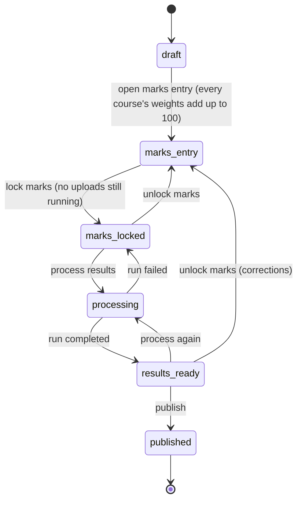
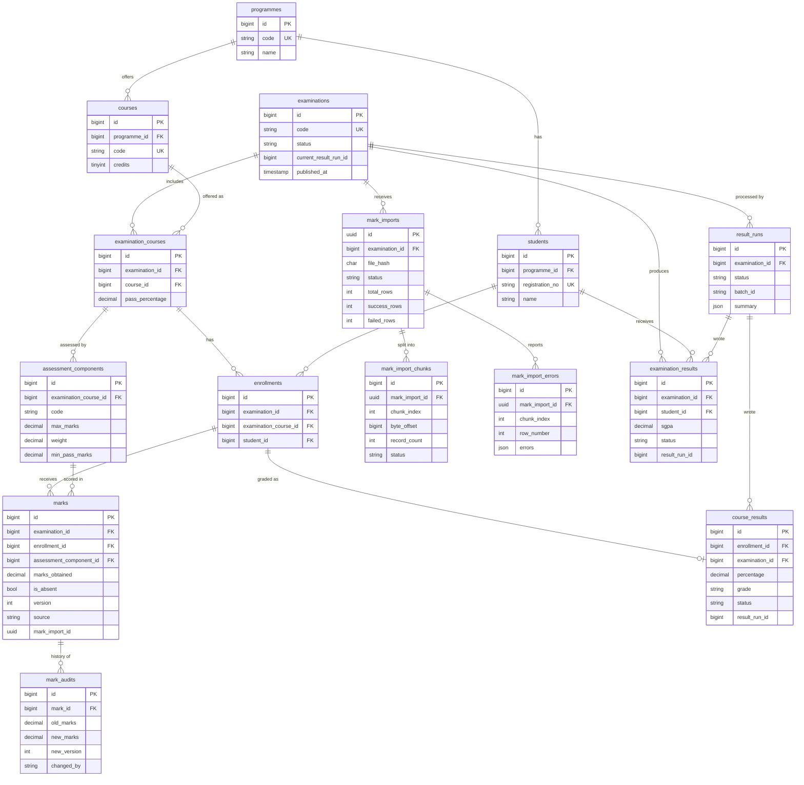

# University Examination & Result Processing System

A backend for running university examinations from start to finish:

1. Staff set up **programmes, courses and students**.
2. They create an **examination**, add its courses, and split each course into weighted **assessment components** (for example Mid term 30% + End term 70%).
3. Students are **enrolled** per course.
4. **Marks** are entered one at a time, or uploaded as a **CSV of 100,000+ rows** that is processed in the background.
5. Marks are **locked**, **results are calculated** in the background (percentage, grade, SGPA), checked, and **published** to students.

It is built as a production-style backend: REST API, queue-based background processing,
safe retries (idempotency), protection against concurrent edits, transactions and tests.
A simple web UI (plain HTML forms) is included to try everything without an API client.

**Stack:** PHP 8.3 · Laravel 12 · MySQL 8.4 (MariaDB 10.4+ also works) · Redis 7 · nginx + php-fpm · Docker Compose

---

## Contents

**Getting started**
1. [Assignment checklist](#1-assignment-checklist): where each requirement is covered
2. [Run with Docker (one command)](#2-run-with-docker-one-command)
3. [Run without Docker (XAMPP / local PHP)](#3-run-without-docker-xampp--local-php)
4. [Try it in 5 minutes (web UI)](#4-try-it-in-5-minutes-web-ui)
5. [Load 100,000+ marks](#5-load-100000-marks)
6. [Using the API](#6-using-the-api)

**Design** (the topics the assignment asks the README to cover)

7. [Architecture](#7-architecture)
8. [Business rules](#8-business-rules)
9. [Database design and ER diagram](#9-database-design)
10. [Queue design](#10-queue-design)
11. [Transaction strategy](#11-transaction-strategy)
12. [Idempotency strategy](#12-idempotency-strategy)
13. [Concurrency strategy](#13-concurrency-strategy)
14. [Failure and retry strategy](#14-failure-and-retry-strategy)
15. [Scaling considerations](#15-scaling-considerations)
16. [Technology choices](#16-technology-choices)
17. [Trade-offs](#17-trade-offs)
18. [Assumptions and intentionally incomplete areas](#18-assumptions-and-intentionally-incomplete-areas)

**Reference**

19. [Testing](#19-testing)
20. [Code tour (for developers new to the project)](#20-code-tour)
21. [Configuration](#21-configuration)
22. [Troubleshooting](#22-troubleshooting)

---

## 1. Assignment checklist

| Requirement from the brief | Where / how |
|---|---|
| Examinations → courses → assessment components, students, marks per component | [§8](#8-business-rules), [§9](#9-database-design) |
| Validate marks, calculate results, publish them | [§8](#8-business-rules): marks validated against each component's maximum; results calculated in the background; publishing makes them visible to students |
| Bulk CSV upload of 100,000+ marks | [§10](#10-queue-design): processed in 1,000-row chunks by parallel workers; 120,000 rows in about 22 s (see [§5](#5-load-100000-marks)) |
| Designed for 1M students / 100k+ per exam / 10k+ courses / several exams at once | [§15](#15-scaling-considerations) |
| Database and API design | [§9](#9-database-design), [§6](#6-using-the-api), Swagger UI at `/docs` |
| Asynchronous, queue-based processing | [§10](#10-queue-design) |
| Concurrency, idempotency, transactions, error handling | [§11](#11-transaction-strategy)–[§14](#14-failure-and-retry-strategy) |
| Scalability, technology choices, trade-offs | [§15](#15-scaling-considerations)–[§17](#17-trade-offs) |
| ER diagram | [§9](#9-database-design) |
| Migrations and a single start command | `database/migrations/`, and `docker compose up` ([§2](#2-run-with-docker-one-command)) |
| Code quality and testing | 65 automated tests ([§19](#19-testing)), code tour ([§20](#20-code-tour)) |
| Simple UI / API client | Web UI at `/`, Swagger UI at `/docs` |
| Assumptions and incomplete areas documented | [§18](#18-assumptions-and-intentionally-incomplete-areas) |

---

## 2. Run with Docker (one command)

**You need:** [Docker Desktop](https://www.docker.com/products/docker-desktop/), started and running. Nothing else: PHP, MySQL and Redis all run inside Docker.

```bash
git clone <this repository>
cd <repository folder>
docker compose up
```

The first start takes about 5 minutes (it downloads MySQL/Redis/PHP and builds the app). Later starts take seconds.
It is ready when the log shows `app-1 | ... ready to handle connections`. Leave the terminal open; **Ctrl + C** stops everything.

| Open | URL |
|---|---|
| **Web UI** | http://localhost:8080 |
| **Swagger UI** (every API endpoint, with "Try it out") | http://localhost:8080/docs (also http://localhost:8081) |
| Student result lookup | http://localhost:8080/results |
| API base URL | http://localhost:8080/api/v1 |
| Health check | http://localhost:8080/up |

**What `docker compose up` starts**

| Service | What it does |
|---|---|
| `mysql` | MySQL 8.4. Reachable from your PC on port **3307** (user `exams`, password `exams`, database `exams`), so it doesn't clash with a local MySQL on 3306 |
| `redis` | Queue and cache |
| `migrate` | Creates all tables, then exits (exit code 0 is expected) |
| `app` + `nginx` | The web UI and API on port 8080 |
| `worker` × 3 | Background workers: process CSV uploads and results. **No need to run `queue:work` yourself** |
| `scheduler` | Hourly/daily clean-up tasks. Its "No scheduled commands are ready to run" log line every minute is normal |
| `swagger` | Standalone Swagger UI on port 8081 |

**Useful commands**

| What | Command |
|---|---|
| Run in the background instead | `docker compose up -d` |
| See logs | `docker compose logs -f app worker` |
| Stop (data is kept) | `docker compose down` |
| Stop and delete all data (fresh start) | `docker compose down -v` |
| More workers (faster imports) | `docker compose up --scale worker=8` |

The app is rebuilt automatically on every `docker compose up`, so code changes are always included.

**Authentication** is off by default so the project is easy to evaluate. To turn it on for the API:
`API_KEYS="registrar:secret1" docker compose up`, then send `Authorization: Bearer secret1`.

---

## 3. Run without Docker (XAMPP / local PHP)

**You need:** PHP 8.2+ (XAMPP's PHP works) with `pdo_mysql`, `mbstring`, `fileinfo`, `openssl`; [Composer](https://getcomposer.org/); MySQL or MariaDB (XAMPP's works). Redis is **not** needed locally: the queue and cache use the database.

```bash
# 1. Create an empty database called "examination" (XAMPP: phpMyAdmin, or:)
mysql -u root -e "CREATE DATABASE examination"

# 2. Install and configure (.env.example already points to examination / root / no password)
composer install
cp .env.example .env
php artisan key:generate
php artisan migrate

# 3. Start the web server
php artisan serve
```

Then, **in a second terminal**, start the background worker, and keep it running:

```bash
php artisan queue:work
```

> Without the worker, CSV uploads stay "pending" and results stay "processing" forever.
> The examination page shows a reminder if that happens.

Open http://127.0.0.1:8000. If your database name, user or password differ, change the `DB_*` lines in `.env`.

---

## 4. Try it in 5 minutes (web UI)

Open the web UI (http://localhost:8080 with Docker, or http://127.0.0.1:8000 locally).
The top menu has four pages: **Examinations**, **Programmes, courses & students**, **Student result lookup** and **API docs**.

**Step 1: master data.** Go to **Programmes, courses & students**:
- Programme: code `BTECH`, name `B.Tech` → *Save programme*
- Course: programme `BTECH`, code `CS101`, title `Programming`, credits `4` → *Save course*
- Students (one per line) → *Save students*:
  ```
  S001, Asha Rao, BTECH
  S002, Ravi Kumar, BTECH
  S003, Meera Iyer, BTECH
  ```

**Step 2: create the examination.** Go to **Examinations**: code `SEM1-2026`, name `Semester 1`, choose the academic year → *Create*.
You land on the examination page. The **"What to do next"** line at the top always tells you the next step.

**Step 3: add the course.** In **1. Courses**, pick `CS101`, keep pass mark 40%, keep the two prefilled components
(MID out of 30 worth 30%, END out of 70 worth 70%) → *Save course*.

**Step 4: enroll.** In **2. Enroll students**, pick `CS101`, type `S001 S002 S003` → *Enroll*. Then click **Open marks entry** at the top.

**Step 5: marks.** In **3. Marks**, upload [`examples/marks-sample.csv`](examples/marks-sample.csv). It has one deliberate mistake
(S003's END mark is 90, above the maximum of 70). The upload shows **5 saved, 1 rejected**; click *See rejected rows* to see why.
You can also enter or *Edit* single marks there.

**Step 6: results.** Click **Lock marks**, then **Process results**. The page refreshes by itself until it's done. Section **4. Results** shows:

| Student | Why | Result |
|---|---|---|
| S001 | MID 27/30 + END 63/70 = 90% → grade O | pass, SGPA 10.00 |
| S002 | absent in MID (counts as 0) + END 50/70 = 50% → grade B | pass, SGPA 6.00 |
| S003 | END mark was rejected, so it's missing | withheld |

Click a registration number to see the course breakdown. To fix S003: **Unlock marks**, add the END mark, then lock and process again.

**Step 7: publish.** Click **Publish results** (this is final). Then open **Student result lookup** and enter `SEM1-2026` + `S001`.
Before publishing, the same lookup shows "No published result found".

---

## 5. Load 100,000+ marks

With Docker running:

```bash
# 20,000 students × 2 courses × 3 components = 120,000 marks expected
docker compose exec app php artisan exams:demo-seed --students=20000 --courses=2

# Generate the CSV (about 0.5% of rows are deliberately invalid) and copy it out
docker compose exec -u www-data app php artisan exams:generate-csv 1
docker compose cp app:/var/www/html/storage/app/demo-marks-1.csv ./demo.csv
```

Upload `demo.csv` on the DEMO-2026 examination page (section 3), or through the API:

```bash
curl -F "file=@demo.csv" -H "Accept: application/json" http://localhost:8080/api/v1/examinations/1/mark-imports
```

(Use the id of the DEMO-2026 examination; it is 1 on a fresh database.)

Measured on a laptop (Docker Desktop on Windows, MySQL 8.4, 3 workers):

| Operation | Volume | Time |
|---|---|---|
| Upload request | 120,000 rows / 3.9 MB | < 1 s (returns 202, work continues in the background) |
| Import, end to end | 120 chunks; 119,380 saved, 620 rejected with reasons | ≈ 22 s |
| Result processing | 20,000 students / 40,000 course results | ≈ 9 s |

Both scale with the number of workers: `docker compose up --scale worker=8`.

---

## 6. Using the API

The easiest way to explore it is **Swagger UI at `/docs`**: every endpoint with examples and "Try it out".
The specification is [`public/openapi.yaml`](public/openapi.yaml). Postman or Insomnia can import it.

### Conventions

| | |
|---|---|
| Base URL | `http://localhost:8080/api/v1` (Docker) or `http://127.0.0.1:8000/api/v1` (local) |
| Format | JSON. Send `Accept: application/json` |
| Errors | Always `{"error": {"code": "...", "message": "...", "details": {...}}}`, with stable codes such as `invalid_state_transition`, `version_conflict`, `marks_not_accepted`, `validation_failed` |
| Safe retries | Send an `Idempotency-Key: <unique id>` header on POST/PUT. Repeating the request returns the first response instead of doing the work twice ([§12](#12-idempotency-strategy)) |
| Editing marks | Send `expected_version` (or `If-Match`). A stale version returns **409** with the current value ([§13](#13-concurrency-strategy)) |
| Long lists | Cursor pagination: follow `next_cursor` with `?cursor=` |
| Auth | Off by default; see `API_KEYS` in [§21](#21-configuration) |

### Endpoints

| Area | Method and path | Purpose |
|---|---|---|
| Master data | `GET/POST /programmes` | List / create-or-update programmes |
| | `GET/POST /courses` | List / create-or-update courses |
| | `GET/POST /students`, `GET /students/{registrationNo}` | List / bulk upsert (≤ 1,000 per call) / get one |
| Examinations | `GET/POST /examinations`, `GET /examinations/{id}` | List / create / get (includes the allowed next statuses) |
| | `PUT /examinations/{id}/courses/{courseCode}` (or `PUT/POST .../courses` with `course_code`) | Add a course with its components (draft only) |
| | `GET /examinations/{id}/courses` | Courses and components of the exam |
| | `POST /examinations/{id}/enrollments` | Enroll students (≤ 5,000 per call; safe to repeat) |
| | `GET /examinations/{id}/progress` | Expected vs entered marks per course |
| Status changes | `POST /examinations/{id}/open-marks-entry` · `lock-marks` · `unlock-marks` · `publish` | Move the examination through its lifecycle ([§7](#7-architecture)) |
| Marks | `PUT /examinations/{id}/marks` | Create or update one mark |
| | `GET /examinations/{id}/marks` | Marks sheet (filter by course / student) |
| CSV imports | `POST /examinations/{id}/mark-imports` | Upload a CSV (returns 202; processed in the background) |
| | `GET /examinations/{id}/mark-imports`, `GET /mark-imports/{id}` | Import list / status and live progress |
| | `GET /mark-imports/{id}/errors`, `GET /mark-imports/{id}/errors.csv` | Rejected rows with reasons (JSON / CSV download) |
| | `POST /mark-imports/{id}/retry` | Re-run only the failed chunks of a failed import |
| Results | `POST /examinations/{id}/result-runs` | Start calculating results (returns 202) |
| | `GET /examinations/{id}/result-runs`, `GET /result-runs/{id}` | Run status, progress, pass/fail summary |
| | `GET /examinations/{id}/results`, `GET /examinations/{id}/results/{registrationNo}` | Staff view of results |
| Public | `GET /public/examinations/{examCode}/results/{registrationNo}` | Student view: published results only, no auth, rate-limited |

### Example with curl

```bash
API=http://localhost:8080/api/v1
H='-H Content-Type:application/json -H Accept:application/json'

curl $H -X POST $API/programmes   -d '{"code":"BTECH","name":"B.Tech"}'
curl $H -X POST $API/courses      -d '{"programme_code":"BTECH","code":"CS101","title":"Programming","credits":4}'
curl $H -X POST $API/students     -d '{"students":[{"registration_no":"S001","name":"Asha","programme_code":"BTECH"}]}'
curl $H -X POST $API/examinations -d '{"code":"SEM1-2026","name":"Semester 1","academic_year":"2026-27"}'
curl $H -X PUT  $API/examinations/1/courses/CS101 -d '{"pass_percentage":40,"components":[
      {"code":"MID","name":"Mid term","max_marks":30,"weight":30},
      {"code":"END","name":"End term","max_marks":70,"weight":70}]}'
curl $H -X POST $API/examinations/1/enrollments -d '{"course_code":"CS101","registration_nos":["S001"]}'
curl $H -X POST $API/examinations/1/open-marks-entry

# One mark (then an update, quoting the version we saw) ...
curl $H -X PUT $API/examinations/1/marks -H 'Idempotency-Key: demo-0001' \
     -d '{"registration_no":"S001","course_code":"CS101","component_code":"MID","marks":24.5}'
curl $H -X PUT $API/examinations/1/marks \
     -d '{"registration_no":"S001","course_code":"CS101","component_code":"MID","marks":25,"expected_version":1}'
# ... or many at once
curl -H Accept:application/json -F file=@examples/marks-sample.csv $API/examinations/1/mark-imports

curl $H -X POST $API/examinations/1/lock-marks
curl $H -X POST $API/examinations/1/result-runs
curl $API/examinations/1/results/S001
curl $H -X POST $API/examinations/1/publish
curl $API/public/examinations/SEM1-2026/results/S001
```

### CSV format

```csv
registration_no,course_code,component_code,marks
S001,CS101,MID,24.5
S001,CS101,END,AB
```

The header row is required. Columns can be in any order and extra columns are ignored. `marks` is a number with at most 2 decimals, or `AB` / `ABSENT` for absent.
Codes are case-insensitive. Invalid rows are rejected with all their reasons; valid rows are saved.

---

## 7. Architecture

```
                 ┌────────────── HTTP (nginx → php-fpm, stateless, can run many copies) ───────────────┐
 browser / ────▶ │ web pages (Blade)  ─┐                                                                │
 API client      │ JSON API ── auth ── Idempotency-Key ── controller ─┴─▶ services (business rules)     │
                 └───────┬───────────────────────────────┬──────────────────────────────┬──────────────┘
                         │ small writes                  │ store file + queue a job     │ queue a job
                         ▼                               ▼                              ▼
                 ┌──────────────┐             ┌──────────────────────┐       ┌───────────────────────┐
                 │    MySQL     │◀────────────│ queue "imports"      │       │ queue "results"       │
                 │  (source of  │   workers   │ Split → N×Chunk →    │       │ Plan → N×Compute →    │
                 │    truth)    │◀────────────│ Finalize             │       │ Finalize              │
                 └──────────────┘             └──────────────────────┘       └───────────────────────┘
                         ▲                    uploaded files: shared volume (S3 in production)
                         └── Redis cache: examination structure (can't change after draft)
```

| Layer | Responsibility | Where |
|---|---|---|
| Web pages | Plain HTML forms for staff and students | `resources/views/`, `app/Http/Controllers/Web/` |
| API | Validation, auth, idempotency, JSON errors | `app/Http/Controllers/Api/`, `app/Http/Middleware/` |
| Services | **All business rules**, transactions and locking. The web pages and the API both call these, so no rule exists twice | `app/Services/` |
| Jobs | Background work (imports, result processing); every job is safe to run twice | `app/Jobs/` |

Design principles:

- **The HTTP request never does bulk work.** An upload stores the file, writes one row and queues a job, so the response time doesn't depend on the file size.
- **One status controls everything.** Every write checks the examination's status (under a database lock) before it's allowed.
- **Every background step is safe to repeat.** Queues can deliver a job twice, so every job is written to give the same result if it runs again.
- **Grading rules are plain PHP with no database access** (`ResultCalculator`), so they are fully unit-tested.

### Examination lifecycle



| Status | Change courses | Enroll | Enter marks | Results visible |
|---|---|---|---|---|
| draft | ✅ | ✅ | ❌ | ❌ |
| marks_entry | ❌ | ✅ | ✅ | ❌ |
| marks_locked / processing | ❌ | ❌ | ❌ | ❌ |
| results_ready | ❌ | ❌ | ❌ | staff only |
| published | ❌ | ❌ | ❌ | staff and students |

The allowed moves are one array, `Examination::ALLOWED_MOVES`, and only `ExaminationLifecycle` changes the status.
Asking for the status the examination already has does nothing, so status changes are safe to repeat.

---

## 8. Business rules

- A **programme** has students and courses.
- An **examination** (e.g. "Semester 1, 2026-27") contains many **courses**. For each course the examination sets a **pass percentage**
  and its **assessment components** (e.g. MID marked out of 30 worth 30%, END out of 70 worth 70%). Weights must add up to 100.
- Students are **enrolled** per course, and get **one mark per component**, or are marked **absent** (`AB`).
- A mark must be between 0 and the component's maximum, with at most 2 decimals.

**Result rules** (`app/Services/ResultCalculator.php`):

| Situation | Course result |
|---|---|
| A component has no mark at all | `withheld`: no grade yet |
| Absent in every component | `absent`, grade `AB` |
| Otherwise, percentage = Σ (marks ÷ max × weight). Absent counts as 0. Rounded to 2 decimals | |
| Percentage below the pass percentage (or below an optional per-component minimum, API only) | `fail`, grade `F`, 0 grade points |
| Otherwise | `pass`, grade from the scale in `config/exams.php`: O ≥ 90, A+ ≥ 80, A ≥ 70, B+ ≥ 60, B ≥ 50, C ≥ 45, P ≥ 40 |

For the whole examination: **SGPA = Σ(credits × grade point) ÷ Σ credits**. A student passes only if every course is passed;
if any course is withheld, the examination result is withheld (no SGPA).

Marks are handled internally as whole numbers of hundredths (45.5 → 4550), so checks never suffer from decimal rounding errors.
The database stores `DECIMAL(6,2)`.

---

## 9. Database design

### ER diagram



### What each table and column is for

**Master data**

| Table | Purpose | Main columns |
|---|---|---|
| `programmes` | Degree programmes | `code` (unique, e.g. BTECH), `name` |
| `students` | Students | `registration_no` (unique; used by forms and CSVs), `name`, `email`, `programme_id` |
| `courses` | Course catalogue, independent of any exam | `code` (unique, e.g. CS101), `title`, `credits` (used for SGPA), `programme_id` |

**Examination setup**

| Table | Purpose | Main columns |
|---|---|---|
| `examinations` | One exam session | `code`, `name`, `academic_year`; `status` (lifecycle step); `current_result_run_id` (the valid result calculation); `published_at` |
| `examination_courses` | Which courses are in this exam. Separate from `courses` so the same course can be examined again with different settings | `examination_id` + `course_id` (unique pair), `pass_percentage` |
| `assessment_components` | Parts of a course in this exam | `code` (MID), `name`, `max_marks` (to validate marks), `weight` (% of the course; all add up to 100), `min_pass_marks` (optional) |
| `enrollments` | Student X takes course Y in this exam | `examination_course_id` + `student_id` (unique pair), `examination_id` (copied here for fast queries) |

**Marks and uploads**

| Table | Purpose | Main columns |
|---|---|---|
| `marks` | One row per student per component (the biggest table) | `enrollment_id` + `assessment_component_id` (unique pair, so a mark can never be stored twice); `marks_obtained`; `is_absent`; `version` (goes up on every change; detects two people editing at once); `source` (typed or CSV); `mark_import_id`; `updated_by` |
| `mark_audits` | History of hand-edited marks | `mark_id`, `old_marks` → `new_marks`, `old_is_absent` → `new_is_absent`, `new_version`, `changed_by`, `created_at` |
| `mark_imports` | One uploaded CSV file | `original_filename`, `file_path`, `file_hash` (same file uploaded twice is detected), `column_map`, `status`, `total_rows` / `success_rows` / `failed_rows`, `total_chunks`, `batch_id`, `failure_reason`, `uploaded_by`, `started_at` / `finished_at` |
| `mark_import_chunks` | The plan for splitting a file into 1,000-row pieces processed in parallel | `chunk_index`, `byte_offset` + `record_count` + `first_row_number` (where the piece is in the file), `skip_rows` (duplicates), `status`, row counts, `attempts` |
| `mark_import_errors` | Rejected rows | `row_number` (line in the file), `raw` (the line), `errors` (every reason), `chunk_index` (−1 = duplicate found while splitting) |

**Results**

| Table | Purpose | Main columns |
|---|---|---|
| `result_runs` | One row per "Process results" | `status`, `batch_id`, `total_chunks`, `students_processed`, `summary` (e.g. pass 13, fail 2, withheld 1), `failure_reason`, `triggered_by`, `started_at` / `finished_at` |
| `course_results` | One row per student per course | `enrollment_id` (unique), `percentage`, `grade`, `grade_point`, `credits`, `status` (pass/fail/absent/withheld), `remarks` (e.g. `absent:MID`), `result_run_id` |
| `examination_results` | One row per student per exam: what the student sees | `examination_id` + `student_id` (unique pair), `credits_attempted`, `credits_earned`, `sgpa`, `status`, `result_run_id` |

**Supporting tables**

| Table | Purpose |
|---|---|
| `idempotency_keys` | Saved API responses for the `Idempotency-Key` header: `key`, `request_hash`, `status`, `response_code`, `response_body`, `expires_at` (24 h) |
| `jobs`, `job_batches`, `failed_jobs` | Laravel queue tables: waiting jobs (local setup), job groups, jobs that failed after all retries |
| `sessions`, `cache`, `cache_locks` | Laravel sessions (success/error messages on the web pages) and cache |
| `users`, `password_reset_tokens` | Created by Laravel by default; not used |

### Key design decisions

| Decision | Why |
|---|---|
| **Unique keys on natural identifiers** (`registration_no`, course `code`, enrollment pair, mark pair, result pair) | Every write is an "insert or update" (`ON DUPLICATE KEY UPDATE` / `INSERT IGNORE`), so the database itself guarantees no duplicates, even with parallel writers |
| **`examination_courses` separate from `courses`** | The same course can be examined in many sessions with different components and weights |
| **`examination_id` copied onto `enrollments`, `marks` and results** | Every heavy query is filtered by examination without joins, and it's the natural key for partitioning later ([§15](#15-scaling-considerations)) |
| **`marks.version`** | Protects against two people editing the same mark ([§13](#13-concurrency-strategy)) |
| **Results stored in tables**, tagged with `result_run_id` | Showing a result is one indexed lookup. A new run overwrites the rows and removes rows from older runs |
| **Publishing is a status change** | Publishing 100,000 results is one row update |
| **`DECIMAL` for marks, weights and percentages** | Exact arithmetic |
| **The import's chunk plan is stored in the database** | Each job only needs "import id + chunk number", and a failed chunk can be retried on its own |
| **Rejected rows stored in a table** | They can be shown on the page, downloaded as CSV, fixed and re-uploaded |

Indexes follow the queries: `(examination_id, student_id)` on enrollments (walking students during result processing),
`(examination_id, result_run_id)` on results (removing old rows), `(mark_import_id, row_number)` on errors (listing), `status` on examinations.
The schema is in `database/migrations/`.

---

## 10. Queue design

Uploads and result processing run on separate queues (`imports` and `results` in Docker), so a huge upload can't delay result processing.
Workers listen to both. Locally everything uses the `default` queue, so a plain `php artisan queue:work` is enough.

### Bulk marks import

```
POST upload ── save file, insert mark_imports (pending), queue the next job ──▶ reply 202 immediately
        │
        ▼
SplitMarkImport  (1 job; reads the file once, start to end)
  • checks the header                      • notes where every 1,000-row piece starts (byte offset)
  • finds duplicate (student, course, component) rows in the WHOLE file
  • saves the chunk plan                   • queues one job per chunk as a batch
        │
        ▼
ProcessMarkImportChunk × N  (in parallel on several workers)
  • jumps straight to its piece of the file and reads its rows
  • validates them with 2 queries per chunk (students, enrollments)
  • one transaction: save marks, save this chunk's rejected rows, save chunk counts
        │  when all chunks are done
        ▼
FinalizeMarkImport ── adds up the chunk counts → completed | completed_with_errors | failed
```

- **Jobs carry only two numbers** (import id, chunk number). The CSV never goes through the queue, so queue memory stays small for any file size.
- **Duplicates are decided before the parallel step.** If the same mark appears twice in a file, "whichever chunk finishes last wins" would be random. The splitter marks the later copy as rejected, so the **first occurrence always wins**.
- **Partial acceptance.** Valid rows are saved, invalid rows are reported with every reason (e.g. `marks: 35.00 exceeds maximum 30.00`).
- **Uploading the same file twice** is detected by its SHA-256 fingerprint, and the existing import is returned.
- **Quoted fields containing line breaks** are handled; the splitter and the chunk jobs read the file the same way (covered by tests).

### Result processing

```
Process results ── status marks_locked → processing + result_runs row (same transaction) ──▶ reply 202
        │
        ▼
PlanResultRun ── walks the enrolled students in id order, in groups of 500
                 → one ComputeResultsChunk job per group, as a batch
        │
        ▼
ComputeResultsChunk × N ── loads the group's enrollments and marks, applies ResultCalculator,
                           saves course_results + examination_results tagged with the run id
        │  when all groups are done
        ▼
FinalizeResultRun ── success: remove rows from older runs, save the summary → results_ready
                     failure: mark the run failed, examination back to marks_locked (just process again)
```

A student is never split across groups, so each job can calculate both the course results and the SGPA of its students.

---

## 11. Transaction strategy

- **Short transactions.** Nothing holds a transaction open for a whole import or run. The unit is one chunk (≤ 1,000 rows or 500 students), which keeps locks short.
- **A chunk is all-or-nothing.** Its marks, its rejected rows and its counts are committed together. If a worker crashes halfway, nothing is left behind and the retry starts clean.
- **A status change and what it starts are committed together.** Creating a result run and moving the exam to `processing` happen in one transaction, and the job is queued only *after* the commit (`afterCommit()`), so a worker never picks up a run that was rolled back.
- **Deadlocks are retried automatically.** Write transactions use `DB::transaction(…, attempts: 3)`. Rows are written in a fixed order (`enrollment_id`, `component_id`) so parallel writers lock rows in the same order.
- **Isolation level: READ COMMITTED** (set in `config/database.php`) instead of MySQL's default REPEATABLE READ. Parallel chunks write different rows, but REPEATABLE READ's gap locks make neighbouring rows deadlock. Correctness comes from explicit row locks and version checks ([§13](#13-concurrency-strategy)), not from snapshots.

---

## 12. Idempotency strategy

"Idempotent" means **safe to repeat**: doing it twice gives the same result as doing it once. Retries happen at three levels, so it's handled at three levels:

| Level | What can repeat | How it's made safe |
|---|---|---|
| **HTTP** | A client or network retries a POST/PUT | `Idempotency-Key` header (`EnsureIdempotency` middleware). The first request claims the key (`INSERT IGNORE` on the primary key) and runs. A retry with the same key and body gets the saved response back (`Idempotent-Replayed: true`). The same key with a different body → 422. A retry while the first is still running → 409 + `Retry-After`. Server errors and temporary 409/423/429 responses are not saved, so they can be retried. Keys are per user and expire after 24 h |
| **Business logic** | The same action is requested twice | Programmes, courses, students and enrollments are "insert or update" by their codes. Asking for the current status again does nothing. "Process results" while a run is going returns that run instead of starting another. Uploading an identical file returns the existing import |
| **Queue** | A job is delivered twice (e.g. worker crashed after finishing but before confirming) | Chunk jobs skip chunks already completed; marks are "insert or update"; a chunk's rejected rows are deleted and rewritten; counts are overwritten, never added to, and the finaliser recalculates totals. Result jobs overwrite their rows. Splitter and planner jobs are unique (`ShouldBeUnique`) and clear their own earlier output first |

---

## 13. Concurrency strategy

There are three different "two things at once" problems, each with its own solution.

**1. Two examiners edit the same mark: optimistic locking.**
Every mark has a `version`. To change it you must say which version you saw (`expected_version` in the API, a hidden field on the web edit page).
The update runs `UPDATE … WHERE id = ? AND version = ?`. If someone changed it first, nothing is updated and you get a **409** with the current value
(on the web page: a message and the latest value). Updating an existing mark without a version → **428**. CSV uploads also increase the version.

> Tested on the running system: 20 simultaneous updates all based on version 1 → exactly **1 succeeded, 19 got 409**, and one audit row was written.

**2. Marks being written while someone locks them: a database lock barrier.**
Everything that writes marks (web form, API, CSV chunk, upload) first takes a *shared* lock on the examination row
(`SELECT … LOCK IN SHARE MODE`) and checks the status is `marks_entry`. Every status change takes an *exclusive* lock (`FOR UPDATE`) on the same row.
Shared locks don't block each other, so uploads still run in parallel. But "Lock marks" waits for the writes in progress to finish,
and any write that starts afterwards sees the new status and is refused. So **no mark can change after marks are locked**.
"Lock marks" is also refused while an upload is still running.

**3. The same work started twice: the status plus unique jobs.**
`marks_locked → processing` can only happen once (under the exclusive lock). Result jobs check that their run is still the examination's
current run, so late jobs from an older run do nothing. Splitter and planner jobs are unique.

Result processing only reads marks while they are locked, so its input can't change underneath it.

---

## 14. Failure and retry strategy

| Failure | What happens |
|---|---|
| Temporary database error or deadlock | The transaction is retried up to 3 times |
| A job crashes or times out | The queue retries it with increasing waits (5 s, 30 s, 2 min, 5 min; up to 5 tries for chunk jobs). A job is never handed to a second worker while the first is still working (`retry_after` 660 s > the longest job timeout) |
| A worker dies mid-job | The job is delivered again later. Jobs are safe to repeat ([§12](#12-idempotency-strategy)) |
| **Bad data** in a row | Not a failure: the row is rejected with reasons and the rest of the file continues |
| A chunk fails even after all retries | The other chunks still finish. The import is marked `failed` with a reason, and `POST /mark-imports/{id}/retry` re-runs only the failed chunks |
| The file itself is invalid (bad header, too many rows) | The import fails immediately with a clear reason, and no marks are written |
| A result group fails after all retries | Results are all-or-nothing: the run is marked failed and the exam goes back to `marks_locked`, ready to process again |
| A web request crashed while holding an idempotency key | The key can be reused after 5 minutes |
| Jobs that keep failing | Kept in `failed_jobs` (`php artisan queue:failed`) and cleaned up after 7 days |

Business-rule errors are expected outcomes, not incidents: the API returns them as JSON (`{"error": {"code", "message", "details"}}`),
the web pages show them as a red message, and they aren't written to the error log.

---

## 15. Scaling considerations

Target from the brief: 1,000,000 students, 100,000+ students per exam, 10,000+ courses, several exams at the same time.

**Data size.** 100,000 students × 6 courses × 3 components = **1.8 million marks per exam**. Over many exams, `marks`, `enrollments` and
`course_results` grow to hundreds of millions of rows.

| Concern | Current design | Next step at larger scale |
|---|---|---|
| Import and result speed | Stateless workers, parallel chunks, tiny job payloads. Add workers to go faster | Separate worker pools per queue with autoscaling (Laravel Horizon) |
| Very large tables | Every heavy query filters by `examination_id`, and indexes start with it | Partition `marks`, `enrollments`, `course_results` by `examination_id`. (MySQL partitioned tables can't have foreign keys, so those checks move into the application.) Archive old exams by swapping partitions out |
| Bulk write speed | Multi-row "insert or update", 1,000 rows per statement | `LOAD DATA INFILE` into a staging table, then one set-based insert per chunk (≈ 5–10× faster) |
| Results day (100,000 students checking at once) | Results are pre-calculated; each lookup is one indexed read; the public endpoint is rate-limited | Cache published results in Redis or a CDN (they never change once published), read replicas |
| File storage | Shared Docker volume | S3. The chunk plan already stores byte offsets, so each worker can download just its part |
| Splitter memory | About 100 bytes per row for duplicate detection (≈ 200 MB at the 2M-row limit) | Detect duplicates in a staging table instead of memory |
| One examination row locked by many writers | Fine for tens of parallel writers | Replace with a version-number check (or `GET_LOCK`) at very high fan-out |
| Database connections | App and workers connect directly | ProxySQL for connection pooling and read/write splitting |

---

## 16. Technology choices

| Choice | Why |
|---|---|
| **MySQL 8 (InnoDB)** | ACID transactions, row locks (`FOR UPDATE`, `LOCK IN SHARE MODE`), fast "insert or update", replication and partitioning, available everywhere. Correct academic records matter more than extreme write scale |
| **Laravel 12 (PHP 8.3)** | Mature queues with batches, retries, unique jobs and after-commit dispatch; migrations; quick to build with. Business rules are plain PHP classes |
| **Redis** | Fast queue backend and shared cache. Job-batch bookkeeping stays in MySQL for durability |
| **nginx + php-fpm** | Standard production setup for PHP. Workers use the same Docker image with a different command |
| **Docker Compose** | One command starts everything, including migrations and workers |
| **Blade pages + Swagger UI** | The brief values correctness over UI polish. Plain HTML forms show the whole workflow with no JavaScript or build step; Swagger documents and exercises the API |

---

## 17. Trade-offs

| Decision | Benefit | Cost |
|---|---|---|
| **CSV imports accept valid rows and reject bad ones** | One typo doesn't block 100,000 marks; only bad rows need fixing | A file isn't all-or-nothing. A strict mode would need a staging table (not built) |
| **Duplicate rows: first occurrence wins** | Same outcome however the parallel chunks run | Needs a full pre-scan of the file and memory per row |
| **Missing marks → `withheld`** instead of blocking processing | Everyone else's results can still be calculated and checked; `/progress` shows the gaps | Withheld students must be sorted out before publishing (not enforced) |
| **Optimistic locking for marks** | Nothing is locked while someone is typing; scales to many examiners | The user must re-check and save again on a conflict |
| **Results all-or-nothing, imports per chunk** | Results are consistent for the whole cohort; imports show progress and keep good rows | Two retry models |
| **Publishing is a status flag** | Instant and atomic | Corrections need unlock + re-process *before* publishing. After publishing, results are final (revaluation not built) |
| **Laravel job batches** | Proven, little code | Batch rows live in the database; extremely large batches (10,000+ jobs) would be split into smaller batches |
| **Static API keys; web pages without login** | Zero setup for reviewers | Not real user accounts or roles (see below) |

---

## 18. Assumptions and intentionally incomplete areas

**Assumptions**

- An examination can include courses from several programmes. Its courses, components and weights are frozen once marks entry opens.
- Registration numbers and course/component codes are case-insensitive and stored upper-case.
- Absent counts as 0 toward the percentage. Absent in *every* component gives an `AB` result.
- A later upload or edit overwrites an earlier mark. Hand edits are recorded in `mark_audits`; CSV-written marks record which file they came from (`marks.mark_import_id`).
- One grade scale for the whole university (`config/exams.php`). The academic year starts in July (the dropdown on the web page).

**Not built on purpose** (what would come next)

- **Login and roles**: real accounts (OIDC/JWT) with roles such as registrar, examiner (only their courses) and student (only their own result). Today the API has static keys and the web pages have no login.
- **Revaluation** after publishing: a versioned amendment process instead of re-opening the exam.
- **Strict (all-or-nothing) imports** and cancelling a running import.
- **Grace marks, moderation, CGPA across semesters, supplementary exams.**
- **Monitoring**: metrics (queue length, chunk time), tracing, alerts on failed runs, a queue dashboard (Horizon).
- **Per-row history for CSV-written marks**: left out because it doubles the writes; each mark keeps a link to its file instead.
- **Table partitioning**: designed ([§15](#15-scaling-considerations)) but not applied, because MySQL partitioning means giving up foreign keys, which isn't worth it at this size.

---

## 19. Testing

```bash
php artisan test                           # fast: SQLite in memory, nothing to set up
vendor/bin/phpunit -c phpunit.mysql.xml    # against real MySQL/MariaDB (needs an empty database "exams_test")
docker compose exec app vendor/bin/phpunit -c phpunit.mysql.xml   # inside Docker (exams_test is created automatically)
```

**65 tests (329 assertions)** pass on SQLite, MariaDB 10.4 and MySQL 8.4.

| Test file | What it proves |
|---|---|
| `tests/Unit/ResultCalculatorTest.php` | Grading: grade boundaries, pass mark, component minimum, absent, withheld, SGPA |
| `tests/Unit/MarkParserTest.php` | Mark parsing: decimals, `AB`, invalid values |
| `tests/Feature/MarkImportTest.php` | CSV uploads across several chunks, rejected rows and CSV export, duplicates across chunks, same file uploaded twice, **a chunk delivered twice**, multi-line fields, bad header, upload refused after lock, lock refused during an upload, **retrying failed chunks** |
| `tests/Feature/MarkEntryTest.php` | Single marks: create/update, **stale version → 409**, `If-Match`, 428, validation, frozen after lock |
| `tests/Feature/ResultProcessingTest.php` | Full lifecycle with pass, fail, withheld and absent students; correction and re-processing; publish rules; students see nothing before publishing |
| `tests/Feature/ExaminationLifecycleTest.php` | Setup through the API, status rules, repeated status changes, "process results" twice returns the same run |
| `tests/Feature/ApiConcernsTest.php` | Idempotency-Key replay and misuse, API keys, who-changed-it recorded, JSON 404s |
| `tests/Feature/CourseOfferingRoutesTest.php` | Adding courses to an exam, clear errors |
| `tests/Feature/WebPagesTest.php` | **The whole process through the web pages**, like a user would do it, plus the API docs page |

The test settings force their own database, so running the tests can never touch your real data.

---

## 20. Code tour

The project uses normal Laravel conventions: controllers, models, migrations and queued jobs.

### Where things live

| Folder / file | What's in it | Start with |
|---|---|---|
| `routes/web.php` | Web page URLs | |
| `routes/api.php` | API URLs | |
| `app/Http/Controllers/Web/` | Web page controllers: read the form, call a service, show a page | `ExamPageController` |
| `app/Http/Controllers/Api/` | API controllers: validate, call a service, return JSON | `ExaminationController` |
| `app/Services/` | **The business rules.** Each class does one job; the web pages and the API both use them | `ExaminationLifecycle`, `ResultCalculator` |
| `app/Services/Imports/` | CSV upload handling | `MarkImportService` |
| `app/Jobs/` | Background jobs (uploads, results) | `SplitMarkImport`, `PlanResultRun` |
| `app/Models/` | One model per table. Statuses are constants, e.g. `Examination::MARKS_ENTRY`, `Examination::ALLOWED_MOVES` | `Examination` |
| `app/Http/Middleware/` | API key check, `Idempotency-Key` handling | |
| `app/Exceptions/AppException.php` | The exception for "you can't do that" (e.g. marks are locked). Shown as JSON in the API and as a red message on web pages | |
| `resources/views/` | Blade templates of the web pages | `exams/show.blade.php` |
| `config/exams.php` | Grade scale, chunk sizes, queue names, API keys | |
| `database/migrations/` | The tables | |
| `app/Console/Commands/` | `exams:demo-seed` and `exams:generate-csv` (large demo data) | |
| `public/openapi.yaml` | API specification (shown at `/docs`) | |
| `examples/marks-sample.csv` | Small CSV used in the walkthrough | |
| `Dockerfile`, `docker-compose.yml`, `docker/` | Docker setup | |
| `tests/` | Automated tests | `WebPagesTest` |

### What happens when a mark is edited

1. The form (or `PUT /api/v1/examinations/1/marks`) reaches a controller.
2. The controller calls `MarkEntryService::upsert()`.
3. The service checks the exam is in `marks_entry` (`ExaminationLifecycle::lockForMarksWrite()`) and that the version still matches,
   then saves the mark and an audit row in one transaction.
4. If a rule is broken it throws `AppException`, which becomes a JSON error (API) or a red message (web page).

### What happens when a CSV is uploaded

1. The controller calls `MarkImportService::create()`: save the file, create a `mark_imports` row, queue `SplitMarkImport`. The user gets an answer immediately.
2. `SplitMarkImport` reads the file once, checks the header, finds duplicates, and splits it into 1,000-row chunks.
3. `ProcessMarkImportChunk` runs once per chunk, on several workers at once: it validates rows (`MarkRowValidator`), saves valid marks and records rejected rows.
4. `FinalizeMarkImport` adds up the totals and sets the final status.

Result processing works the same way: `PlanResultRun` → `ComputeResultsChunk` per group of students → `FinalizeResultRun`.

### Words used in the code

| Word | Meaning here |
|---|---|
| **Idempotent** | Safe to repeat: doing it twice has the same effect as once |
| **Idempotency-Key** | A unique id a client sends with a request; a repeat of the same request gets the first answer back |
| **Optimistic locking / `version`** | Each mark has a version number; an edit must name the version it saw, otherwise it's refused (409) |
| **Row lock** (`lockForUpdate`, `sharedLock`) | Makes other database transactions wait, so two things can't change the same row at once |
| **Upsert** | "Insert, or update if it already exists", in one SQL statement |
| **Chunk** | A slice of a big job (1,000 CSV rows, or 500 students) so several workers can share the work |
| **Batch** | Laravel's way of running many jobs and then one final step when all are done |
| **Hundredths** | Marks as whole numbers × 100 (45.5 → 4550) to avoid decimal rounding problems (`MarkParser`) |
| **Withheld** | A result that can't be declared yet because marks are missing |
| **Catalog** (`ExaminationCatalog`) | A cached copy of an exam's courses and components, so they aren't queried for every CSV row |

---

## 21. Configuration

Settings come from `.env` (local) or `docker-compose.yml` (Docker).

| Setting | Default | Meaning |
|---|---|---|
| `DB_CONNECTION`, `DB_HOST`, `DB_PORT`, `DB_DATABASE`, `DB_USERNAME`, `DB_PASSWORD` | local: `mysql`, `127.0.0.1`, `3306`, `examination`, `root`, empty | Database connection |
| `DB_ISOLATION_LEVEL` | `READ COMMITTED` | Transaction isolation ([§11](#11-transaction-strategy)) |
| `QUEUE_CONNECTION` | local: `database`, Docker: `redis` | Where background jobs are stored |
| `CACHE_STORE` | local: `database`, Docker: `redis` | Cache backend |
| `API_KEYS` | empty (auth off) | API keys, `name:token,name2:token2`. The name is recorded as who made each change |
| `IMPORT_CHUNK_SIZE` | `1000` | CSV rows per background job |
| `IMPORT_MAX_ROWS` / `IMPORT_MAX_FILE_KB` | `2000000` / `102400` | Upload limits |
| `IMPORT_QUEUE` / `RESULTS_QUEUE` | local: `default`, Docker: `imports` / `results` | Queue names |
| `RESULTS_STUDENTS_PER_CHUNK` | `500` | Students per result job |
| `IDEMPOTENCY_TTL_HOURS` | `24` | How long `Idempotency-Key` responses are kept |

The grade scale is in `config/exams.php`.

---

## 22. Troubleshooting

| Problem | Fix |
|---|---|
| An upload stays "pending" or results stay "processing" | The background worker isn't running. Locally: run `php artisan queue:work` in a second terminal. Docker starts workers automatically |
| `docker compose up`: "port is already allocated" | Something else uses port 8080, 8081 or 3307. Stop it, or change the left-hand port numbers in `docker-compose.yml` (e.g. `"8090:80"`) |
| The first `docker compose up` is slow | Normal: it downloads and builds everything once (≈ 5 minutes). Later starts are fast |
| I want an empty Docker database | `docker compose down -v`, then `docker compose up` |
| `SQLSTATE ... Unknown database 'examination'` (local) | Create it first: `mysql -u root -e "CREATE DATABASE examination"` |
| MySQL tests fail with "Unknown database 'exams_test'" | Create it: `mysql -u root -e "CREATE DATABASE exams_test"`. In Docker, if the database volume is older than the setup: `docker compose exec mysql mysql -uroot -proot -e "CREATE DATABASE IF NOT EXISTS exams_test; GRANT ALL ON exams_test.* TO 'exams'@'%'"` |
| A mark edit says someone else changed it | Working as intended ([§13](#13-concurrency-strategy)): the page now shows the latest value; check it and save again |
| "Cannot move examination from … to …" | That step isn't allowed from the current status; the "What to do next" line on the exam page shows the right step ([§7](#7-architecture)) |
